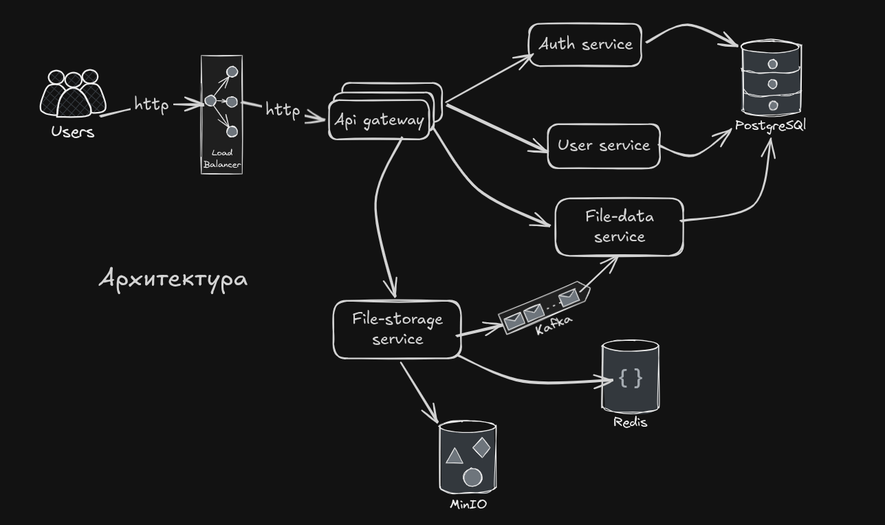
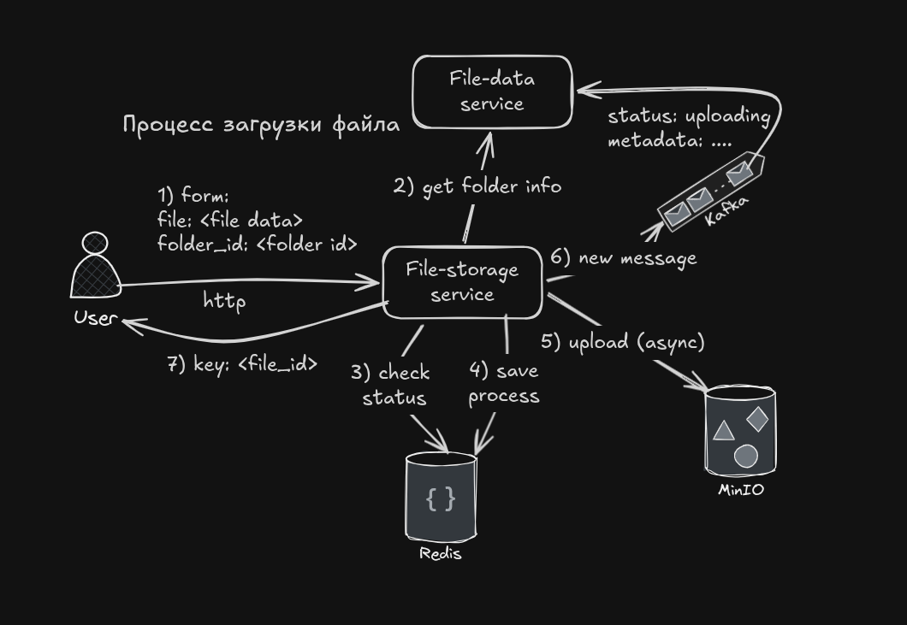
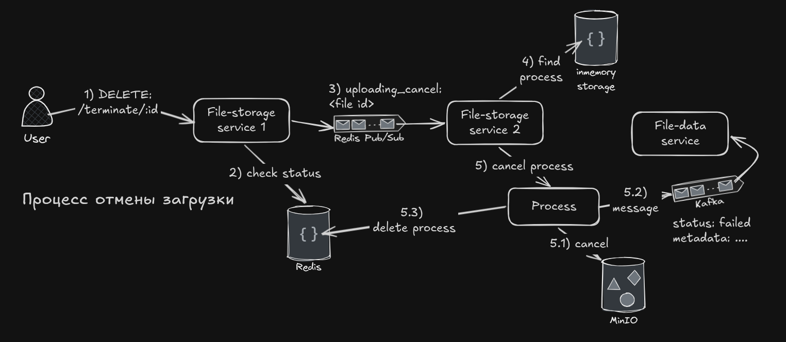
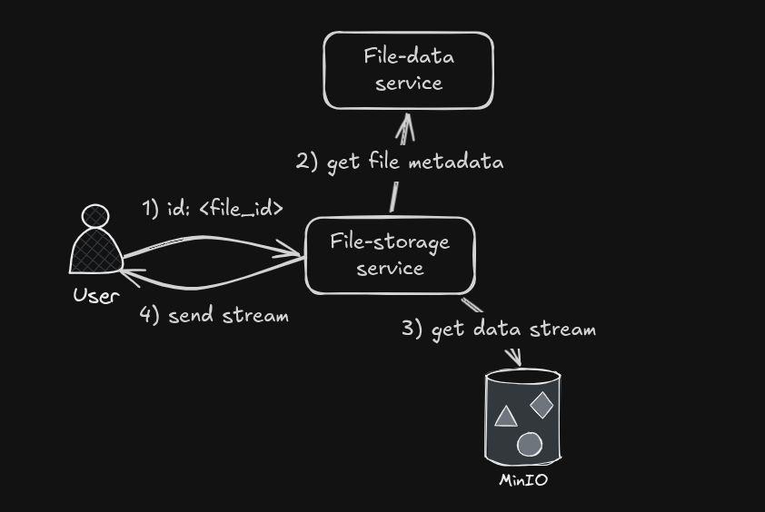

## Важно

Это учебный проект, над которым я работал в команде. В нем я разрабатывал **file-storage-service** и **file-data-service**. Этот репозиторий направлен на демонстрацию этих сервисов. Вся остальная часть проекта – работа команды.

## Аналог Я.Диска

Проект представляет собой упрощённый аналог Яндекс.Диска, реализованный в виде микросервисной архитектуры.
Система поддерживает регистрацию и аутентификацию пользователей, управление папками, загрузку, скачивание, поиск и удаление файлов.

Все сервисы взаимодействуют между собой по HTTP через единый API Gateway и разворачиваются в Docker-контейнерах.

## Оглавление

- [Важно](#важно)
- [Аналог Я.Диска](#аналог-ядиска)
- [Оглавление](#оглавление)
- [Архитектура](#архитектура)
- [File Data Service](#file-data-service)
  - [Rest API](#rest-api)
  - [Kafka](#kafka)
  - [PostgreSQL](#postgresql)
  - [Redis](#redis)
- [File Storage Service](#file-storage-service)
  - [Rest API](#rest-api-1)
  - [MinIO](#minio)
  - [Redis](#redis-1)
  - [Kafka](#kafka-1)
  - [Graceful Shutdown](#graceful-shutdown)
- [Масштабируемость](#масштабируемость)
  - [File Storage Service](#file-storage-service-1)
  - [File Data Service](#file-data-service-1)
- [Быстрый старт](#быстрый-старт)
  - [Требования](#требования)
  - [Запуск](#запуск)
  - [Тестовый пример](#тестовый-пример)
- [Основные сценарии](#основные-сценарии)
  - [Загрузка файла](#загрузка-файла)
  - [Отмена загрузки](#отмена-загрузки)
  - [Скачивание файла](#скачивание-файла)
- [Остальные микросервисы](#остальные-микросервисы)

## Архитектура




Проект реализован в виде набора независимых микросервисов, каждый из которых отвечает за свою зону ответственности.
Внешний доступ осуществляется только через Nginx и API Gateway.

## File Data Service

Предназначен для хранения метаданных файлов и иерархии директорий пользователей. 

### Rest API

Подробнее можно посмотреть в [OpenAPI спецификации](./docs/swagger.yaml)

Основные методы:

| Method | Path | Description |
| --- | --- | --- |
| GET | `/files` | Поиск по файлам |
| GET | `/files/:id` | Получение метаданных файла |
| GET | `/folders` | Информация о корневой папке |
| GET | `/folders/:id` | Получение информации о папке |
| GET | `/folders/tree/:id` | Получение содержимого папки |
| POST | `/folders` | Создание папки |

### Kafka

- Чтение событий из топика `uploading_files`.
- Используется `Rate limit` на чтение для ограничения нагрузки на сервис (значение по умолчанию = 10).
- Используется `Semaphore Weighted` для ограничения обрабатываемых одновременно событий (значение по умолчанию = 10).

### PostgreSQL

- Хранение метаданных файлов.
- Хранение иерархии директорий.
- Поиск по файлам.

### Redis

- Управление очередью обработки сообщений из Kafka. 
  
     Соблюдение порядка обработки событий для предотвращения race conditions: 
     - начало загрузки -> конец загрузки.
     - начало загрузки -> отмена загрузки.
      
  Выбран с учетом хранения временных данных и быстрых операций чтения и записи.


## File Storage Service

Предназначен для работы с процессами загрузки и скачивания файлов.

### Rest API

Подробнее можно посмотреть в [OpenAPI спецификации](./docs/swagger.yaml)

Основные методы:

| Method | Path | Description |
| --- | --- | --- |
| POST | `/file` | Загрузка файла |
| DELETE | `/terminate/:id` | Отмена загрузки файла |
| GET | `/file/:id` | Скачивание файла |
| DELETE | `/file/:id` | Удаление файла |

### MinIO

S3-совместимое объектное хранилище.
Используется как файловое хранилище проекта.

### Redis

- Redis Cache
  
  Используется для контроля текущих процессов загрузки файлов.
  - хранение текущих загрузок.
  - контроль повторных загрузок.

- Redis Pub/Sub

  Отмена загрузки файла.

  Выбран для доставки сообщений об отмене загрузки всем инстансам File Storage.

### Kafka

Отправка событий в топик `uploading_files` о начале, конце и отмене загрузки файлов.

Выбран для асинхронной обработки событий.

### Graceful Shutdown

При остановке сервис дожидается окончания всех процессов загрузки, после чего завершает работу. Таймаут на завершение = 20 минут. При завершении новые загрузки не запускаются.

## Масштабируемость

### File Storage Service
- **Горизонтальное масштабирование** — несколько инстансов обрабатывают загрузки.
- **Redis Pub/Sub** — координация между инстансами при отмене загрузки.
- **In-memory хранилище** — каждый инстанс хранит свои активные процессы.

### File Data Service
- **Rate limiting** — защита от перегрузки (10 req/sec).
- **Semaphore** — ограничение параллельных обработок (10 concurrent).
- **Kafka consumer group** — балансировка нагрузки между инстансами.

## Быстрый старт

### Требования

- Docker и Docker Compose
  
### Запуск

```bash
# Клонируйте репозиторий
git clone https://github.com/apple5343/disk.git
cd disk

# Запустите инфраструктуру
docker compose --env-file ./config/docker.env up -d
```

### Тестовый пример

Тестовый пример доступен в виде [postman коллекции](./docs/disk_example_collection.json). Приведены примеры регистрации, входа, загрузки и скачивания файла. В коллекции созданы variables. Для запуска нужно импортировать коллекцию в Postman. При загрузке файла необходимо выбрать локальный файл.

## Основные сценарии

Для тестирования доступна [postman коллекция](./docs/disk_example_collection.json)

### Загрузка файла 



1. Пользователь отправляет запрос на загрузку файла. Запрос содержит:
   - данные файла (контент, метаданные)
   - ID директории, в которую будет загружен файл
2. File Storage отправляет запрос к File Data для получения информации о директории.
3. Проверяется наличие процесса загрузки в Redis.
4. Процесс загрузки сохраняется в Redis.
5. Создается новый процесс загрузки.
6. Создается событие в Kafka о начале загрузки.
7. Пользователь получает ответ с ID файла загрузки.

При завершении загрузки процесс посылает событие в Kafka о завершении загрузки.

### Отмена загрузки



1. Пользователь отправляет запрос на отмену загрузки.
2. Проверяется наличие процесса загрузки в Redis.
3. Сообщение об отмене загрузки посылается в Redis Pub/Sub.
4. Каждый инстанс File Storage получает сообщение об отмене загрузки и проверяет наличие процесса в своем in-memory хранилище.
5. Процессу загрузки посылается сигнал об отмене (реализовано с помощью отмены контекста). Происходит остановка процесса: 
   
   1. Прерывается загрузка файла в MinIO.
   2. Посылается событие в Kafka об отмене загрузки.
   3. Процесс загрузки удаляется из Redis.

### Скачивание файла



1. Пользователь отправляет запрос на скачивание файла.
2. File Storage отправляет запрос к File Data для получения метаданных файла.
3. Отправляется запрос к MinIO для получения потока чтения.
4. Пользователь получает ответ с потоком чтения.

## Остальные микросервисы

- **api-gateway**

   Единая точка входа в систему. Отвечает за:
   - маршрутизацию HTTP-запросов к внутренним сервисам.
   - retry-логику.
   - circuit breaker.
   - fallback-ответы.
   - проверку доступности сервисов.

- **auth-service**

   Сервис аутентификации и авторизации.
   - регистрация пользователей.
   - логин.
   - выдача JWT-токенов.
   - использует `user-service` для работы с данными пользователей.

- **user-service**

   Сервис управления пользователями.
   - хранение и обработка данных пользователей (id, email, username, password hash и т.д.).
   - работа с PostgreSQL.
